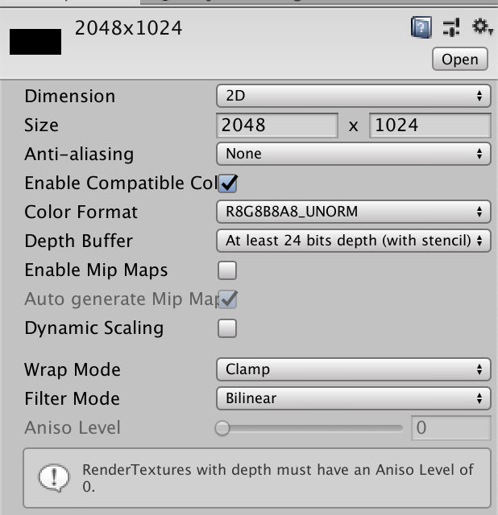
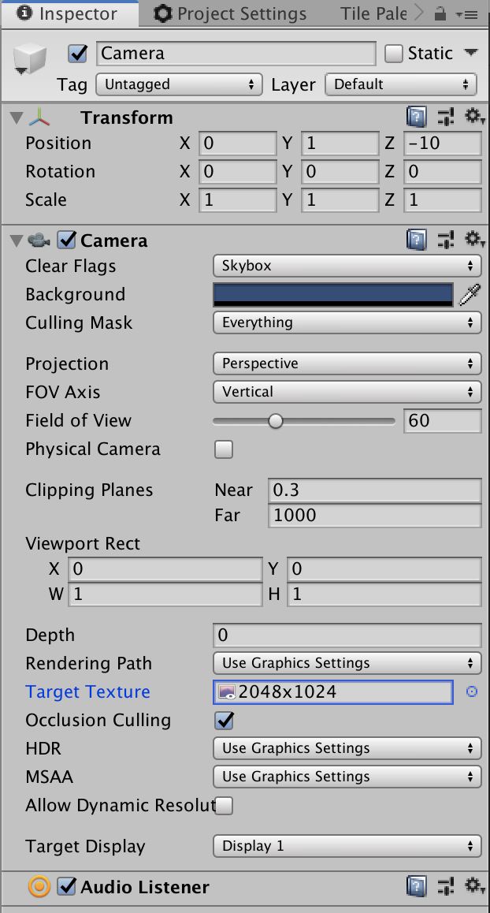

# Unity Simulation How To's

## Change Screen Capture Resolution
By default Unity Simulation's resolution of screen captures is 640x480. The resolution of screen captures can be altered by using a Render Texture and following the steps below.

First create a Render Texture by going to, `Assets` -> `Create` -> `Render Texture`
. The desired resolution is then set in the Inspector Window under `Size`.



And finally for each camera in your scene drag the render texture onto `Target Texture` while also making sure that `HDR` is set to `Off`.



You can find the official Unity documentation on Render Textures [here](https://docs.unity3d.com/Manual/class-RenderTexture.html).


## Retrieve Authentication token for Direct API calls

The recommended method of retrieving your bearer token is by using the `usim` Command Line Interface tool from the [latest](https://github.com/Unity-Technologies/Unity-Simulation-Docs/releases) release of the Unity Simulation bundle.

Use the [usim login auth](cli.md#usim-login-auth) command to authenticate with your Unity ID. After successfully authenticating you can find your token by inspecting the `token.json` file located in your Home directory.

```
mac
~/.usim/token.json

win
%HOMEPATH%/.usim/token.json
```

This JSON file will have several keys present. The value for the `access_token` key can be used to make API calls to the Unity Simulation service by setting the `Authorization` http header to `Bearer <insert_access_token_here>`.

This token has a relatively short expiration and may need to be periodically refreshed by using the [usim login refresh](cli.md#usim-login-refresh) command.

example curl command:

```
curl <your_url_and_flags> -H 'Authorization: Bearer <your_access_token>'
```
