# Unity SDK integration

The goal of this tutorial is to take an empty Unity project, import the Unity Simulation SDK, create a simple scene, and implement Screen Capture, Data Capture and Application Parameter features.

**Note: Data captured will be available for download for 90 days, after which it will be automatically deleted.**

## Prerequisites to setting up the SDK
This tutorial assumes the user has some familiarity with the Unity Editor. If concepts such as creating game objects or scripts, attaching components to game objects, or tagging game object are unfamiliar we suggest completing the  [Roll-A-Ball](https://learn.unity.com/project/roll-a-ball-tutorial) tutorial before continuing this guide.

Other Prerequesites:
- Unity Account
- Unity version >= 2018.3.f1 (>= 2019.3 for [SRP](https://docs.unity3d.com/Manual/ScriptableRenderPipeline.html) support)
- Supported platforms: Windows10+ and 0SX (High-Sierra or newer)
- Linux build support installed

Please refer to the [Requirements guide](requirements.md) for instructions on how to meet these prerequisites.


## Create a new Unity project
Open Unity Hub and create a new Unity project using the `3D` template with a project name that does not contain any spaces.

**Note:** Ensure Display Resolution Dialog is Disabled in the `Resolution and Presentation` menu in [PlayerSettings](https://docs.unity3d.com/Manual/class-PlayerSettings.html). Player Settings can be found by navigating to `Edit` -> `Project Settings` -> and select `Player` in the left window panel.

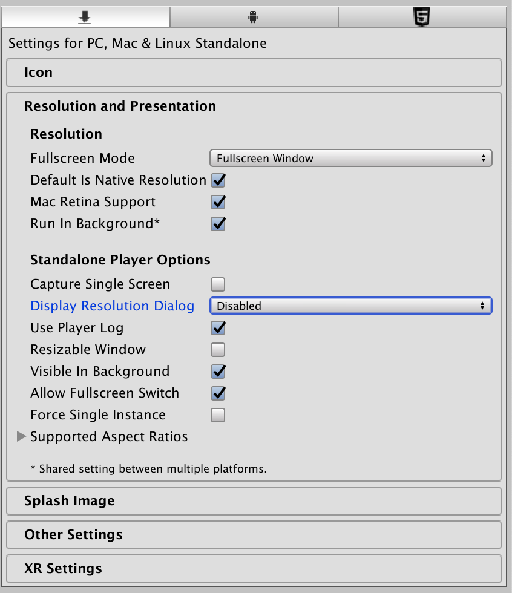

Make sure the  Scripting Runtime version is set to “.NET 4.x Equivalent” in Build Player Settings under ‘Other Settings’.
Set API Compatibility level to .NET 4.x as shown below.

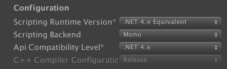

## Import SDK
Download the [latest](https://github.com/Unity-Technologies/Unity-Simulation-Docs/releases) release of the Unity Simulation bundle and the Unity Simulation SDK under the `Assets` drop down at the bottom of each release.

>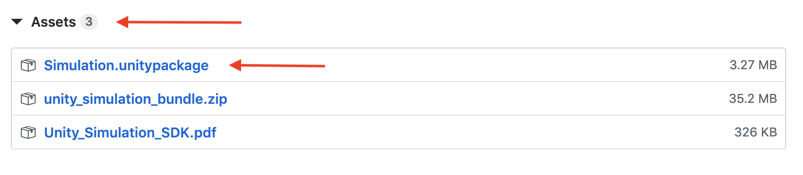

Import the SDK into your project from the menu bar by navigating to `Assets` -> `Import Package` -> `Custom Package` and selecting the downloaded SDK package.

Alternatively, you can import the SDK by double clicking the `Simulation.unitypackage` and selecting `Import`.

You might encounter the following error during an import. Click clear to see if this error is transient.
```
Unable to update following assemblies:Assets/DataExchange/Assemblies/Simulation.dll (Name = Simulation, Error = 131) (Output: /var/folders/ks/f3gbl2ld59j5748n3rx5qqp00000gp/T/tmpc84219a.tmp)

System.InvalidOperationException: Operation is not valid due to the current state of the object.
  at Mono.Cecil.ModuleDefinition.ReadSymbols (Mono.Cecil.Cil.ISymbolReader reader) [0x0002f] in <a3989f8c34e6476eaca56644d5639ee8>:0
```

## Screen Capture

Create a new empty GameObject and name it DataCapture.

Then expand the Assets/DataExchange/Assemblies/Simulation by clicking the arrow button on it's icon, as shown below.

Locate the CameraGrab script in the Simulation assembly and attach it to the DataCapture GameObject.
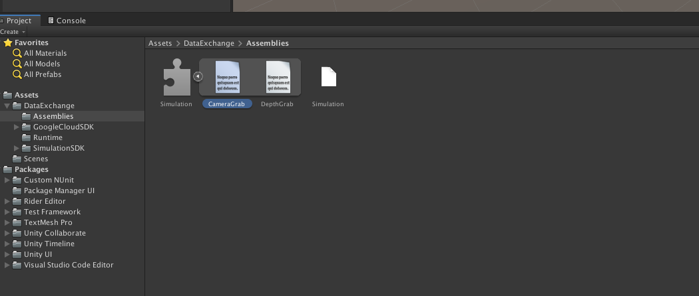


With the DataCapture game object selected, expand Camera Sources in the Inspector window and set the size to 1 since we will only be using a single camera in this scene. Then, drag the Main Camera onto Camera Sources' Element 0 in the CameraGrab Script.

**NOTE:** Setting the Camera Sources size to 1 will  throw the following exception in the Editor console which can be safely cleared once a camera has been added to Element 0.
```
UnassignedReferenceException: The variable _cameraSources of CameraGrab has not been assigned.
You probably need to assign the _cameraSources variable of the CameraGrab script in the inspector.
```

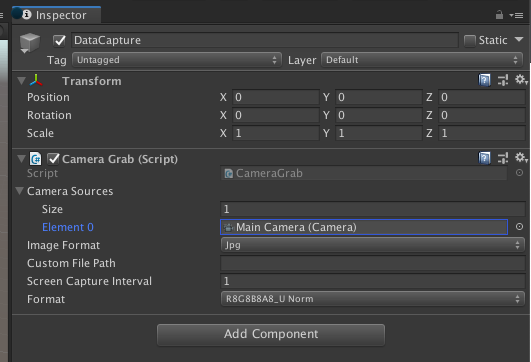

Create the following script in the Editor and attach it to the `DataCapture` game object.

TestDataCapture.cs
```csharp
using Unity.AI.Simulation;
using UnityEngine;

public class TestDataCapture : MonoBehaviour
{
    void Start()
    {
        // Print path where data will be saved
        Debug.LogFormat("DataCapturePath: {0}/{1}", Application.persistentDataPath, Configuration.Instance.GetAttemptId());
    }
}
```

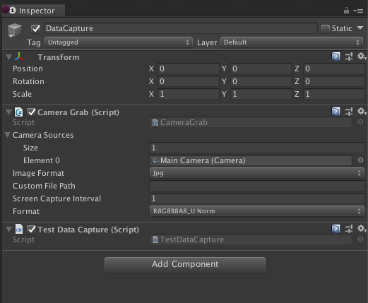

**NOTE:** [Persistent Data Path](https://docs.unity3d.com/ScriptReference/Application-persistentDataPath.html) is a directory path where data is stored between runs on a device.
For every simulation execution a new `attempt id` will be generated and a corresponding directory will be created at the `Application.persistentDataPath` to store all captured data.

Press the play button in the Editor and after a couple of seconds you can then navigate to the path that was printed to the Editor console to inspect the captured data.
Inside should be a `ScreenCapture` directory containing all captured image data.

If you are only interested in collecting screen shots from a simulation these are the only steps required!

## Data Capture

Collecting data from a running simulation can be done using the Unity Simulation DataLogger class. The only requirement is that the data being logged is contained in a serializable class.

You can find more detailed information about the DataLogger class [here](sdk-documentation.md)

Create the following script in the Editor.

ObjectPosition.cs
```csharp
using UnityEngine;

[System.Serializable]
public class ObjectPosition : System.Object
{
    public ObjectPosition(Vector3 pos, string objectName)
    {
        this.pos = pos;
        this.objectName = objectName;
    }

    public Vector3 pos;
    public string objectName;
}

```
Edit the TestDataCapture script so that it matches the code below.

TestDataCapture.cs
```csharp
using Unity.AI.Simulation;
using UnityEngine;

public class TestDataCapture : MonoBehaviour
{
    private Unity.AI.Simulation.Logger dataLogger;

    // Create and Log a vector
    void Start()
    {
        // Print the location where data will be written
        Debug.LogFormat("DataCapture Path: {0}/{1}",
            Application.persistentDataPath, Configuration.Instance.GetAttemptId());

        // Create new data logger with output files named DataCapture
        dataLogger = new Unity.AI.Simulation.Logger("DataCapture");

        Vector3 examplePosition = new Vector3(0, 1, 2);

        //Create a new data point
        ObjectPosition objectPosition = new ObjectPosition(examplePosition, "ExampleObjectName");
        dataLogger.Log(objectPosition);

        // Flush written objectPosition to file
        dataLogger.Flushall();
    }
}
```

After pressing play in the Editor for a couple of seconds, navigate to the `Application.persistentDataPath/{ATTEMPT-ID}/Log` directory to view all logged data.

DataCapture_0.txt File Content
```json
{"pos":{"x":0.0,"y":1.0,"z":2.0},"objectName":"ExampleObjectName"}
```

## Integrating Application Parameters with Data Capture

The following steps will detail how to create a simple scene that uses the Application Parameter, app-param, functionality of the Unity Simulation SDK with Data Capture.

Also please reference the [taxonomy guide](taxonomy.md#app-param-app-param) for a quick description of an app-param.

### Tags
Using the same scene as above we are going to create two new tags named `DataCapture` and `Cube` that we will use to reference our game objects.

While having any game object selected in the scene hierarchy click the `Tag` drop down.

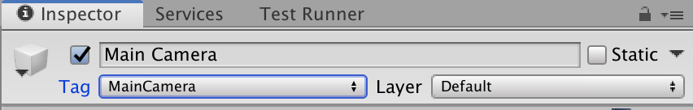

Select `Add Tag`


Click on the `+` to add new tags.


## GameObjects

Set the `DataCapture` game object’s tag to `DataCapture`.

Add a cube to the scene and set its tag as `Cube`.

**NOTE:** You may need to move the cube so that it is visible in the `Main Camera`

## Scripts
Two scripts are necessary to load the app-param file’s contents from our scene. A `CubeAppParam` class containing all parameters we wish to update in our scene and a `ParamReader` class to read the app-param values from the passed file, update parameters, replicate the cube game object, and determine when to quit the application.

CubeAppParam.cs
```csharp

[System.Serializable]
public class CubeAppParam
{
    public int replicateCube;
    public int quitAfterSeconds;
    public float screenCaptureInterval;

    public override string ToString()
    {
        return "CubeAppParam: " +
               "\nreplicateCube: " + replicateCube +
               "\nquitAfterSeconds: " + quitAfterSeconds +
               "\nscreenCaptureInterval: " + screenCaptureInterval;
    }
}

```

ParamReader.cs
```csharp
/*
 * ParamReader.cs
 *
 * Get AppParams values from AppParam file passed during execution from command line.
 *
 * Update corresponding variables in scene.
 */
using UnityEngine;
using Unity.AI.Simulation;

public class ParamReader : MonoBehaviour
{
    private Unity.AI.Simulation.Logger paramLogger;
    private Unity.AI.Simulation.Logger cubeLogger;
    private CubeAppParam appParams;
    private static float quitAfterSeconds;
    private static float simElapsedSeconds;


    /*
     *  Instantiates copies of Cube,
     *  moves them to a new location in the scene,
     *  and creates and logs dataPoint object.
     */
    public void ReplicateCube(GameObject cube, int replicateNum)
    {
        for (int i = 0; i < replicateNum; i++)
        {
            Vector3 cubePosition = new Vector3((i + 1) * 2.0F, 0, 0);
            GameObject newCube = Instantiate(cube, cubePosition, Quaternion.identity);
            newCube.name = newCube.name + "_" + i;

            //Create a new data point
            ObjectPosition cubeDataPoint = new ObjectPosition(cubePosition, newCube.name);
            cubeLogger.Log(cubeDataPoint);
        }
    }

    void Start()
    {
        // Create a specific logger for AppParams for debugging purposes
        paramLogger = new Unity.AI.Simulation.Logger("ParamReader");
        cubeLogger = new Unity.AI.Simulation.Logger("CubeLogger");
        simElapsedSeconds = 0;

        // NOTE: AppParams can be loaded anytime except during `RuntimeInitializeLoadType.BeforeSceneLoad`
        // If the simulation is running locally load app_param_0.json
        if (!Configuration.Instance.IsSimulationRunningInCloud())
        {
            string appParamFilename = "app_param_0.json";
            Configuration.Instance.SimulationConfig.app_param_uri =
                string.Format("file://{0}/StreamingAssets/{1}", Application.dataPath, appParamFilename) ;
            Debug.Log(Configuration.Instance.SimulationConfig.app_param_uri);
        }

        appParams = Configuration.Instance.GetAppParams<CubeAppParam>();

        // Check if AppParam file was passed during command line execution
        if (appParams != null)
        {
            // Log AppParams to Player.Log file and Editor Console
            Debug.Log(appParams.ToString());

            // Log AppParams to DataLogger
            paramLogger.Log(appParams);
            paramLogger.Flushall();

            // Update the screen capture interval through an app-param
            float screenCaptureInterval = Mathf.Min(Mathf.Max(0, appParams.screenCaptureInterval), 100.0f);
            GameObject.FindGameObjectsWithTag("DataCapture")[0].GetComponent<CameraGrab>()._screenCaptureInterval = screenCaptureInterval;
            // ReplicateCube
            ReplicateCube(GameObject.FindGameObjectsWithTag("Cube")[0], appParams.replicateCube);

            // Set the Simulation exit time.
            quitAfterSeconds = appParams.quitAfterSeconds;
        }
    }

    // Exit sim after simulation has ran for quitAfterSeconds defined in AppParams.
    private void Update()
    {
        // SimulationElapsedSeconds represents the aggregate frame seconds
        // Refer
        // - https://docs.unity3d.com/ScriptReference/Time-deltaTime.html for more on seconds since last frame
        // - Unity.AI.Simulation.DXTimeLogger for examples of logtime methods
        // - https://docs.unity3d.com/ScriptReference/Time.html for time information from Unity.
        // - https://docs.microsoft.com/en-us/dotnet/api/system.diagnostics.stopwatch?view=netframework-4.8 (MSDN stopwatch for elapsedSeconds)
        simElapsedSeconds += Time.deltaTime;

        if (simElapsedSeconds >= quitAfterSeconds)
        {
            // Flush all Cube data point data to file before exiting
            cubeLogger.Flushall();
            Application.Quit();
        }

    }
}
```
*NOTE: Application.Quit() does not work while playing from within the Editor and will log a message to the console.*

Attach the `ParamReader` script to the `DataCapture` game object while disabling the `TestDataCapture` script component by unchecking it in the `Inspector` window.

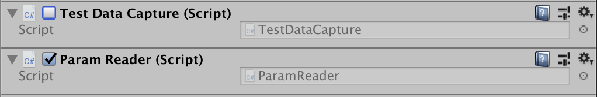

## Creating Application Parameters Folder and Files

### Streaming Assets Folder
Create a new folder to hold the app-params in `Assets` and name it `StreamingAssets`.
After creating a build this directory will be placed on the local filesystem of the target machine allowing for all files contained within to be accessible via a path name.

**NOTE**: this is a reserved Unity directory name and must be located in the `Assets` folder.
Please reference the [Streaming Assets documentation](https://docs.unity3d.com/Manual/StreamingAssets.html) for more information.

### Create Application Parameter Files
Next we are going to create two app-param files with varying parameters and place them in the `Assets/StreamingAssets` directory created in previous step.

Open a text editor, paste the json blobs below, and save with a `.json` extension to the `StreamingAssets` directory.

First define an app-param file that creates 4 copies of the Cube game object in the scene while taking screen captures every 5 seconds that attempts to quit the simulation after running for [ten frame seconds](time-logging).

app_param_0.json
```json
{
    "replicateCube": 4,
    "quitAfterSeconds": 10,
    "screenCaptureInterval": 5
}
```

We will then define another app-param file that creates 40 copies of the Cube game object while taking screen captures every second that quits after running for 180 frame seconds.


app_param_1.json
```json
{
    "replicateCube": 40,
    "quitAfterSeconds": 180,
    "screenCaptureInterval": 1
}
```

## Confirming Application Parameters in Editor

After all of the scripts have been attached to their respective game objects and the app param files have been added to the Assets directory pressing play in the Editor will show five cubes in your scene.

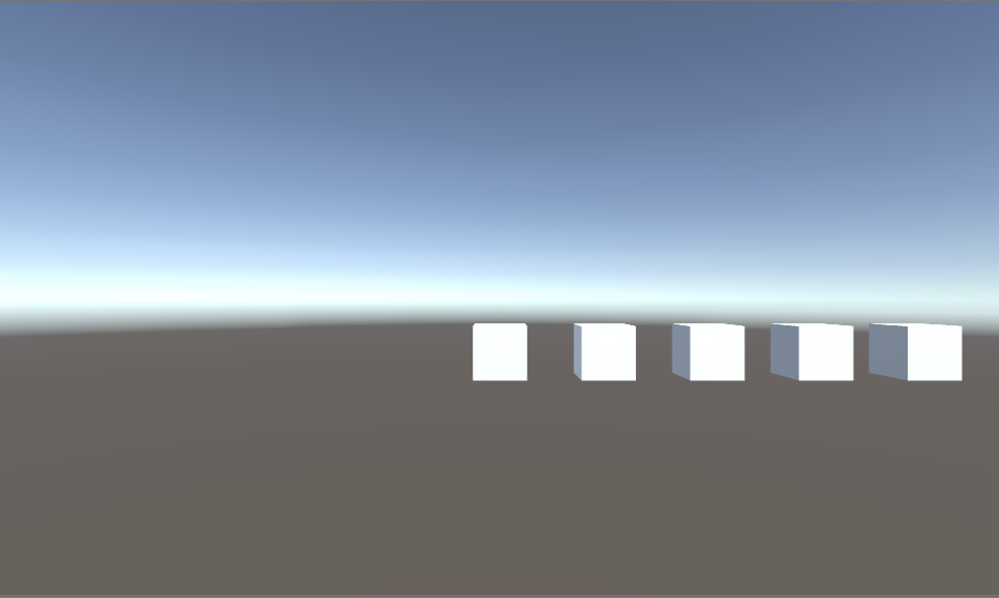

**NOTE**: Actual rendering may differ depending on where the initial cube added to scene was placed.

To test `app_param_1.json` locally, change the appParamFilename variable on line 50 of `ParamReader.cs` to refer to `app_param_1.json` instead of `app_param_0.json`.

```csharp
string appParamFilename = "app_param_1.json";
```


Again, navigate to the `Application.persistentDataPath` that was printed to the Editor console and look for a directory whose name resembles something like, `c75e0048-836e-469d-b4fb-e2ccfbc5d331` with a `Log` directory inside which should contain all logged data and a `ScreenCapture` directory that contains all screen capture images.

CubeLogger_0.txt contents:
```json
{"pos":{"x":2.0,"y":0.0,"z":0.0},"objectName":"Cube(Clone)_0"}
{"pos":{"x":4.0,"y":0.0,"z":0.0},"objectName":"Cube(Clone)_1"}
{"pos":{"x":6.0,"y":0.0,"z":0.0},"objectName":"Cube(Clone)_2"}
{"pos":{"x":8.0,"y":0.0,"z":0.0},"objectName":"Cube(Clone)_3"}
```

ParamReader_0.txt contents:
```json
{"replicateCube":4,"quitAfterSeconds":10,"screenCaptureInterval":5.0}
```

That is everything required for integrating app-param files into a Unity scene.

If you would like to  submit this test scene to Unity Simulation Cloud please reference the [Unity Simulation Building Project](build.md) doc for instructions on how to build and zip this scene and the [Unity Simulation Quick Start guide](quickstart.md) an example walkthrough of how to submit a simulation to the Unity Simulation Cloud.

## Enabling Profiler
If you are experiencing some performance issues running your simulation locally or in the Unity Simulation cloud you can collect resource usage stats by following the steps below.

Enable profiling for a number of areas using the following API. Details on the types of Profiler Areas can be found [here](https://docs.unity3d.com/2018.3/Documentation/ScriptReference/Profiling.ProfilerArea.html) and [here](https://docs.unity3d.com/Manual/ProfilerWindow.html)

The API will enable profiling for the entire session of the simulation and will generate a binary file at `Application.persistentDataPath/{ATTEMPT-ID}/Logs/profilerLog.txt.raw`  which can be opened in the unity profiler. Using EnableProfiler API requires a development player build in order to generate the profilerlog.txt.raw file, which can be enabled in the BuildSettings as shown below.


### Build Settings
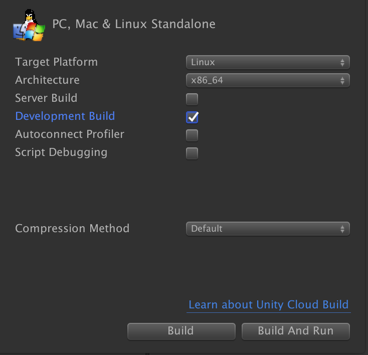

### Enabling Profiler
Add the following lines to the `Start()` function of a script that gets called when the scene starts.

For example, you can add this to the Start() function in `ParamReader.cs`

```
var profilingAreas = new UnityEngine.Profiling.ProfilerArea[] { UnityEngine.Profiling.ProfilerArea.CPU, UnityEngine.Profiling.ProfilerArea.GPU, UnityEngine.Profiling.ProfilerArea.Physics };
DXProfilerManager.EnableProfiling(profilingAreas);
```
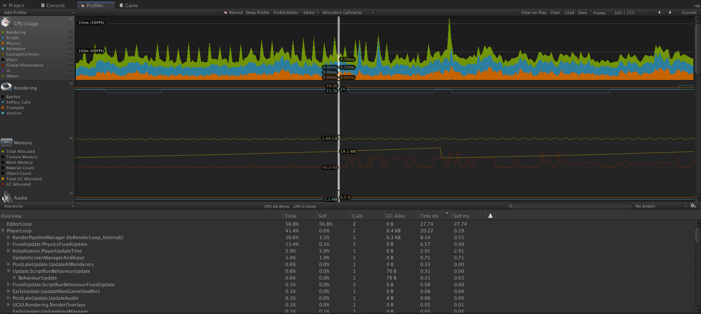


## Time Logging
By default the SDK will log the following times to the Player.log. The logging interval defaults to 10 seconds.

A sample log line looks like this
```
DC[I]: USim Time (secs) : Wall(10.178) Simulation(10.004) Unscaled(11.699) FPS(55.778)
```

Refer the `Unity.AI.Simulation.DXTimeLogger`

| Name | Description |
|---|---|
| Wall Time | The actual time that passes, as if you were looking at a clock on the wall. |
| Simulation Time | The amount of time that has been simulated. Pausing will stop time, as will setting time scale. |
| Unscaled Simulation Time | Same as Simulation Time, but unaffected by time scale. |
| FPS | The number of frames per second as calculated based on Simulation Time. |

There are also several properties that can be used to turn on and off individual fields above.

```
    // The defaults for each property.
    public static bool logSimulationTime         { get; set; } = true;
    public static bool logUnscaledSimulationTime { get; set; } = true;
    public static bool logWallTime               { get; set; } = true;
    public static bool logFrameTiming            { get; set; } = true;

    // To turn a field off, use...
    DXTimeLogger.logSimulationTime = false;
```
