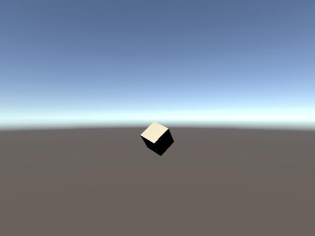

# Correlating Screen Captures to Data Logging
 The [integration guide](integrate.md) details how to save screen captures and how to log serializable data to a file.
 Since these two actions are performed asynchronously we will need to call the Unity Simulation APIs directly and use the image name as a joining key between images and logged data.


In this guide we will create a short simulation that runs for five seconds. The simulation will generate a screen capture and associated data point each second and then quit.
 ### Implementation
 - Create a new Unity scene
 - Import Unity Simulation package into Unity
 - Create a C# script named DataPoint and paste the following code
```csharp
using UnityEngine;

[System.Serializable]
public class DataPoint : System.Object
{
    public string objectName;        // Name of displaying camera
    public float x;                  // X Rotation of game object
    public float y;                  // Y Rotation of game object
    public float z;                  // Z Rotation of game object
    public float time;              // Time of screen/data capture
    public string screenCaptureName; // Name of saved image to correlate data

    public DataPoint(string objectName, Quaternion rotation, float time, string screenCaptureName)
    {
        this.objectName = objectName;
        this.x = rotation.x;
        this.y = rotation.y;
        this.z = rotation.z;
        this.time = time;
        this.screenCaptureName = screenCaptureName;
    }
}
```
- Create a C# script named `ScreenDataCapture` and paste the following code

```csharp
using UnityEngine;
using Unity.AI.Simulation;
using UnityEngine.Experimental.Rendering;
using System;

public class ScreenDataCapture : MonoBehaviour
{
    // Camera object in scene
    public Camera _camera;
    public GameObject _cube;

    private int duration = 5;
    private int captureInterval = 1;
    private int lastCapture;
    private float simElapsed;
    private bool quit; // Editor use only, minimizes screen/data captures
    private Unity.AI.Simulation.Logger dataLogger;
    private string screenCapturePath;

    private void Start()
    {
        Debug.Log(Application.persistentDataPath + "/" + Configuration.Instance.GetAttemptId());
        screenCapturePath = DXManager.Instance.GetDirectoryFor(DataCapturePaths.ScreenCapture);
        // Data logger defaults to the same run directory as ScreenCapture
        dataLogger = new Unity.AI.Simulation.Logger("DataCapture");
    }

    private void Capture(int num)
    {
        string imageName = _camera.name + "_" + num;

        // Define Data point object outside async call
        DataPoint dataPoint = new DataPoint(_cube.name, _cube.transform.rotation, simElapsed, imageName);

        // Call Screen Capture
        var screen = CaptureCamera.Capture(_camera, request =>
        {
            string path = screenCapturePath + "/" + imageName + ".jpg";

            // Convert the screen capture to a byte array
            Array image = CaptureImageEncoder.Encode(request.data.colorBuffer as Array, 640, 480, GraphicsFormat.R8G8B8A8_UNorm,
                    CaptureImageEncoder.ImageFormat.Jpg, true);

            // Write the screen capture to a file
            var result = DXFile.Write(path, image);

            // Wait for Async screen capture request to return and then log data point
            if (result)
            {
                // Log data point to file
                dataLogger.Log(dataPoint);

                return AsyncRequest.Result.Completed;
            }

            return AsyncRequest.Result.Error;
        });
    }

    private void Update()
    {
        // Get total time sim elapsed
        simElapsed += Time.deltaTime;

        // Sim has hit duration, flush all data and quit application
        if (simElapsed >= duration && !quit)
        {
            dataLogger.Flushall();
            quit = true;
            Debug.Log("Quitting...");
            Application.Quit();
        }

        // Capture Data if last time capture time was over 1 second ago
        if ((int)simElapsed - lastCapture >= captureInterval && !quit)
        {
            Capture(lastCapture);
            lastCapture = (int)simElapsed;
        }
    }
}
```

- Create an empty GameObject and drag the `ScreenDataCapture` on to it and then drag and drop the `Main Camera` into the `_camera` slot
- Add a cube to the scene and drag the cube onto the `_cube` slot  in the `ScreenDataCapture`  component.
- Create a C# script named `CubeSpinner` and paste the following code

```csharp
using UnityEngine;

public class CubeSpinner : MonoBehaviour
{
    void Update()
    {
        transform.Rotate(0, 50 * Time.deltaTime, 50 * Time.deltaTime);
    }
}
```
- Drag and drop the `CubeSpinner` script onto the cube game object.
- Press play again to stop the scene once the `Quitting...` message appears in the console.
- Navigate to the `Application.persistentDataPath` that was logged to the console by the`ScreenDataCapture` script after pressing the play button.
- Finally, locate a directory named with a random GUID with `Screencapture` and `Logs` directories contained within to look at your data.

## Data
- The contents of the logged data in the `Logs` directory
```json
{"objectName":"Cube","x":0.015206203795969487,"y":0.4096302390098572,"z":0.4170513153076172,"time":1.013169527053833,"screenCaptureName":"Main Camera_0"}
{"objectName":"Cube","x":0.011952600441873074,"y":0.6593078374862671,"z":0.6751770973205566,"time":2.000636339187622,"screenCaptureName":"Main Camera_1"}
{"objectName":"Cube","x":0.004186167847365141,"y":0.6690274477005005,"z":0.6876687407493591,"time":3.0099940299987795,"screenCaptureName":"Main Camera_2"}
{"objectName":"Cube","x":-0.005022712983191013,"y":0.43267545104026797,"z":0.44719454646110537,"time":4.004084587097168,"screenCaptureName":"Main Camera_3"}
```

- `Main Camera_0` Image form the `ScreenCaptures` directory



- Using the `screenCaptureName` value in each logged DataPoint we can determine that the cube rotation values in the above image are
`(0.015206203795969487, 0.4096302390098572, 0.4170513153076172)` and they were captured at `1.013169527053833` seconds during the simulation.