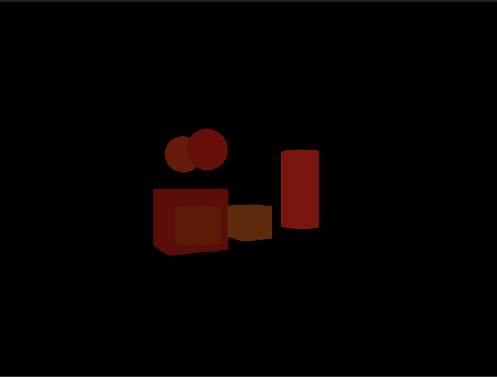

## How to Implement Semantic Segmentation on Unity Simulation

- Open Unity and create a new scene.
- Import the Unity Simulation SDK.
- Create three tags named `Cube`, `Sphere`, and `Cylinder`.
- Create some cubes, spheres, and cylinders to the scene and tag them with their corresponding tag name.
    - Move the created objects around so that parts of all are visible to the camera.
- Create a new camera at the same position in the scene  as the `Main Camera` and name it `SegmentedCam`.
- Create a C# script named `CameraSpinner` and attach to both `Main` and `Segmented` cameras.
```csharp
using UnityEngine;


/*
 * Script rotates Main Camera around scene origin
 */
public class CameraSpinner : MonoBehaviour
{
    // Update is called once per frame
    void Update()
    {
        transform.RotateAround(Vector3.zero, Vector3.up, 20 * Time.deltaTime);
    }
}


```
- Create an Unlit Shader named `Segmentation` and paste the following into the `Segmentation` shader.
```csharp
Shader "Unlit/Segmentation"
{
    /*
    * Unlit shader that colors whole game objects a single color determined
    *   by the _SegmentColor value for semantic segmentation.
    */
    Properties
    {
        _SegmentColor ("Segment Color", Color) = (1,1,1,1)
    }

    CGINCLUDE
    #include "UnityCG.cginc"
    ENDCG

    SubShader
    {
        Tags
        {
            "RenderType"="Opaque"
            "Queue" = "Overlay"
        }

        Pass
        {
            Cull Back
            CGPROGRAM
            #pragma vertex vert
            #pragma fragment frag

            fixed4 _SegmentColor;

            struct vertInput {
                float4 pos : POSITION;
            };

            struct vertOutput {
                float4 pos : SV_POSITION;
            };

            vertOutput vert(vertInput input) {
                vertOutput o;
                o.pos = UnityObjectToClipPos(input.pos);
                return o;
            }

            fixed4 frag(vertOutput output) : COLOR {
                return _SegmentColor;
            }
            ENDCG
        }
   }
}
```

- Create a C# script named `ApplyInstanceCountability` and paste the following.
```csharp
using System.Collections.Generic;
using UnityEngine;

public class ApplyInstanceCountability : MonoBehaviour
{

    public Shader segmentShader;
    public Camera segmentCamera;

    // Dictionary of Label Name -> Label Id
    Dictionary<string, int> segmentDict = new Dictionary<string, int>();

    void Start()
    {
        // Fill the Dictionary with Tag names and 'label id'
        segmentDict.Add("Cube", 100);
        segmentDict.Add("Sphere", 111);
        segmentDict.Add("Cylinder", 131);

        foreach (var entry in segmentDict)
        {
            string label = entry.Key;
            int label_id = entry.Value;

            // Object instance counters
            byte green = 0;
            byte blue = 0;

            GameObject[] gameObjects = GameObject.FindGameObjectsWithTag(label);

            for (int i = 0; i < gameObjects.Length; i++)
            {
                var renderer = gameObjects[i].GetComponent<MeshRenderer>();
                var mpb = new MaterialPropertyBlock();

                // Reset green back to 0 for scenes with more than 255 game objects per tag
                if (green > 255)
                {
                    green = 0;
                    blue += 1;
                }

                // Create new color  with the current label id and green blue instance counters
                Color32 objColor = new Color32((byte)label_id, green, blue, 255);

                // Set the _SegmentColor variable  used by the segment shader
                mpb.SetColor("_SegmentColor", objColor);
                renderer.SetPropertyBlock(mpb);

                // Value set to 20 so color difference between objects is obvious to human eye.
                green += 20; // += 1;
            }

        }

        // Finally set the Segment shader as replacement shader on camera
        segmentCamera.SetReplacementShader(segmentShader, "RenderType");
    }
}
```

- Create a script called `InstanceDataCapture` and paste the following.
```csharp
using UnityEngine;
using Unity.AI.Simulation;
using UnityEngine.Experimental.Rendering;
using System;
using System.Collections.Generic;
using Newtonsoft.Json;

public class InstanceDataCapture : MonoBehaviour
{
    // Camera object in scene
    public Camera _camera;

    private int duration = 10;
    private int captureInterval = 1;
    private int lastCapture;
    private float simElapsed;
    private bool quit; // Editor use only, minimizes screen/data captures
    private Unity.AI.Simulation.Logger dataLogger;
    private string screenCapturePath;

    private void Start()
    {
        Debug.Log(Application.persistentDataPath + "/" + Configuration.Instance.GetAttemptId());
        screenCapturePath = DXManager.Instance.GetDirectoryFor(DataCapturePaths.ScreenCapture);
        // Data logger defaults to the same run directory as ScreenCapture
        dataLogger = new Unity.AI.Simulation.Logger("DataCapture");
    }

    private void Capture(int num)
    {
        string imageName = _camera.name + "_" + num;

        Dictionary<string, int> labelInstances = new Dictionary<string, int>();

        // Call Screen Capture
        var screen = CaptureCamera.Capture(_camera, request =>
        {
            string path = screenCapturePath + "/" + imageName + ".jpg";

            // Convert the screen capture to a byte array
            Array image = CaptureImageEncoder.Encode(request.data.colorBuffer as Array, 640, 480, GraphicsFormat.R8G8B8A8_UNorm,
                    CaptureImageEncoder.ImageFormat.Jpg, true);

            // Write the screen capture to a file
            var result = DXFile.Write(path, image);

            // Wait for Async screen capture request to return and then log data point
            if (result)
            {
                labelInstances.Add("Cube", 100);
                labelInstances.Add("Sphere", 111);
                labelInstances.Add("Cylinder", 131);
                string temp = JsonConvert.SerializeObject(labelInstances);
                InstanceCount instanceCount = new InstanceCount(imageName, temp);
                // Log data point to file
                dataLogger.Log(instanceCount);

                return AsyncRequest.Result.Completed;
            }

            return AsyncRequest.Result.Error;
        });
    }

    private void Update()
    {
        // Get total time sim elapsed
        simElapsed += Time.deltaTime;

        // Sim has hit duration, flush all data and quit application
        if (simElapsed >= duration && !quit)
        {
            dataLogger.Flushall();
            quit = true;
            Debug.Log("Quitting...");
            Unity.AI.Simulation.Logger successLogger = new Unity.AI.Simulation.Logger("_Success");
            Application.Quit();
        }

        // Capture Data if last time capture time was over 1 second ago
        if ((int)simElapsed - lastCapture >= captureInterval && !quit)
        {
            Capture(lastCapture);
            lastCapture = (int)simElapsed;
        }
    }
}
```

Pressing Play in the Editor should show something similar to the following image in the Scene view.



Navigate to the `Application.persistentDataPath` that was logged to the console to find all captured images saved in the `Screencapture` directory.

NOTE: Because the JPG format is compressed it will not produce pixel perfect results. If you need pixel perfect segmentation use the `RAW` format. However, since the `RAW` format produces images that are not easily viewed they will need some post processing.
Please reference the [Image Format](image_formats.md) docs for an example of how to convert to PNG file type.