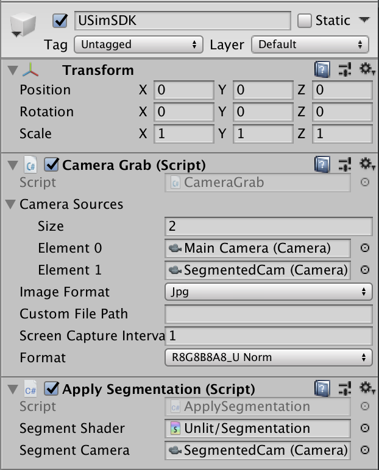
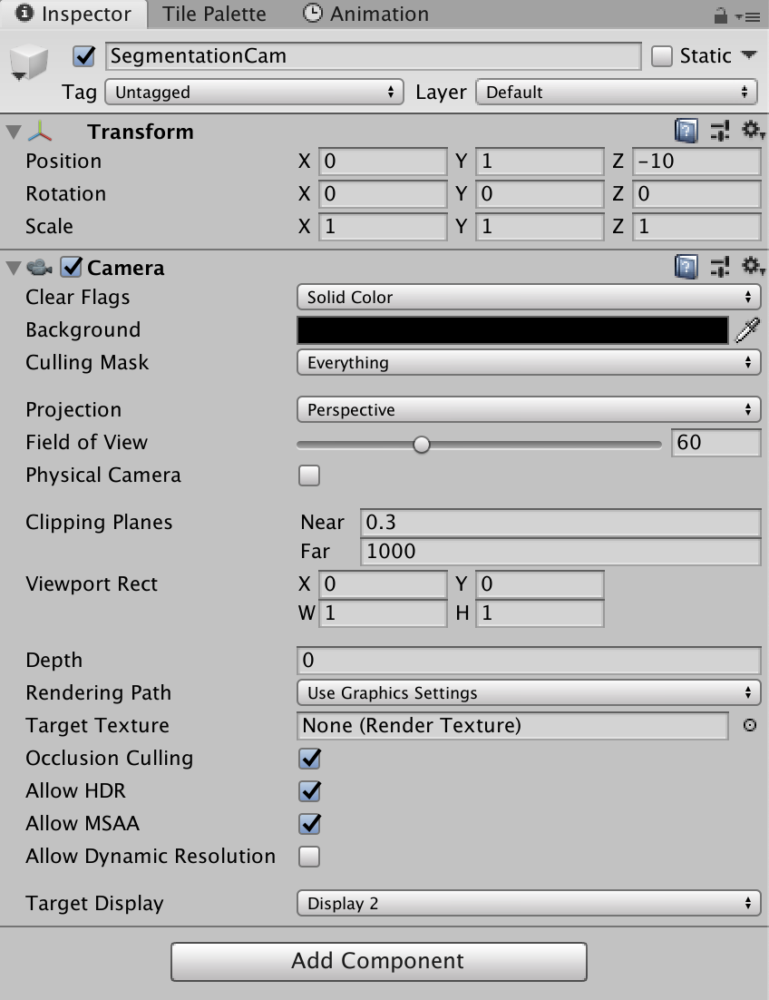
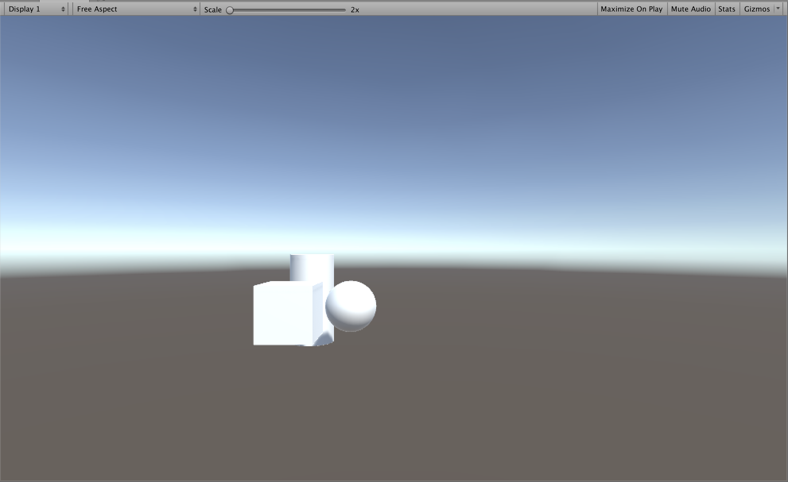
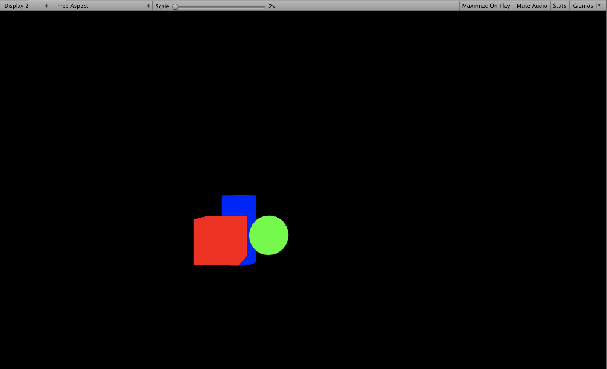

## How to Implement Semantic Segmentation on Unity Simulation

- Open Unity and create a new scene. 
- Import the Unity Simulation SDK.
- Create three tags named `Cube`, `Sphere`, and `Cylinder`.
- Create a cube, sphere, and cylinder and tag them with their corresponding tag name.
    - Move them slightly so that parts of all three are visible to the camera.
- Create a new camera at the same position in the scene  as the `Main Camera` and name it `SegmentedCam`.
- Create a C# script named `CameraSpinner` and attach to both `Main` and `Segmented` cameras.
```csharp
using UnityEngine;


/*
 * Script rotates Main Camera around scene origin
 */
public class CameraSpinner : MonoBehaviour
{
    // Update is called once per frame
    void Update()
    {
        transform.RotateAround(Vector3.zero, Vector3.up, 20 * Time.deltaTime);
    }
}


```

- Create an Unlit Shader named `Segmentation` and paste the following into the `Segmentation` shader.
```csharp
Shader "Unlit/Segmentation"
{
    Properties
    {
        _SegmentColor ("Segment Color", Color) = (1,1,1,1)
    }

    CGINCLUDE
    #include "UnityCG.cginc"
    ENDCG

    SubShader
    {
        Tags 
        {
            "RenderType"="Opaque"
            "Queue" = "Overlay"  
        }

        Pass 
        {
            Cull Back
            CGPROGRAM
            #pragma vertex vert             
            #pragma fragment frag
         
            fixed4 _SegmentColor;
            
            struct vertInput {
                float4 pos : POSITION;
            };  

            struct vertOutput {
                float4 pos : SV_POSITION;
            };

            vertOutput vert(vertInput input) {
                vertOutput o;
                o.pos = UnityObjectToClipPos(input.pos);
                return o;
            }

            fixed4 frag(vertOutput output) : COLOR {
                return _SegmentColor;
            }
            ENDCG
        }  
   }
}
```

- Create a C# script named `ApplySegmentation` and paste the following into the `ApplySegmentation` script.
```csharp
using System.Collections.Generic;
using Unity.AI.Simulation;
using UnityEngine;

public class ApplySegmentation : MonoBehaviour
{

    public Shader segmentShader;
    public Camera segmentCamera;

    Dictionary<string, Color32> segmentDict = new Dictionary<string, Color32>();

    void Start()
    {
        Debug.Log(Application.persistentDataPath + "/" + Configuration.Instance.GetAttemptId());

        // Fill the Dictionary with Tag names and corresponding colors
        segmentDict.Add("Cube", new Color32(255, 0, 0, 255));
        segmentDict.Add("Sphere", new Color32(0, 255, 0, 255));
        segmentDict.Add("Cylinder", new Color32(0, 0, 255, 255));

        // Find all GameObjects with Mesh Renderer and add a color variable to be
        // used by the shader in it's MaterialPropertyBlock
        var renderers = FindObjectsOfType<MeshRenderer>();
        var mpb = new MaterialPropertyBlock();
        foreach (var r in renderers)
        {

            if (segmentDict.TryGetValue(r.transform.tag, out Color32 outColor))
            {
                mpb.SetColor("_SegmentColor", outColor);
                r.SetPropertyBlock(mpb);
            }
        }

        // Finally set the Segment shader as replacement shader
        segmentCamera.SetReplacementShader(segmentShader, "RenderType");
    }
}
```

- Create an empty GameObject and name it `USimSDK` and then drag the `ApplySegmentation`  and `CameraGrab` script, located in `DataExchange -> Assemblies -> Simulation`, onto the `USimSDK` game object.

#### Camera Grab Script Location


### Unity Simulation SDK 
Under the `ApplySegmentation` component, drag and drop the `Segmentation` shader and `SegmentationCam` onto their respective places.


Under the `USimSDK` component , set the `Size` variable under `Camera Sources` to `2` and drag and drop the `Main Camera` and `SegmentationCam` cameras  onto `Element` 0 and 1, and set the `Image Format` to  `jpg`.


### Segmentation Cam
On the `Camera` component change the `Clear Flags` to `Solid Color` and change the background color to solid black, (0,0,0,0). For local testing purposes set the `Target Display` to `Display 2`. When submitting a simulation to Unity Simulation  be sure to revert the `Target Display` back to `Display 1`.


### Local Test
By pressing play in the Editor you should be able to switch between `Display 1` and `Display 2` to see the results of the segmentation shader.

### Display 1 from Main Camera


### Display 2 from SegmentedCam


After pressing play in the Editor, navigate to the `Application.persistentDataPath` that was logged to the console to find all captured images saved in the `Screencapture` directory.

NOTE: Because the JPG format is compressed it will not produce pixel perfect results. If you need pixel perfect segmentation use the `RAW` format. However, since the `RAW` format produces images that are not easily viewed they will need some post processing.
Please reference the [Image Format](image_formats.md) docs for an example of how to convert to PNG file type.